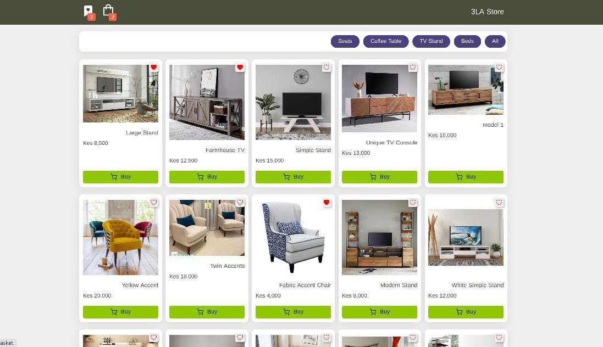
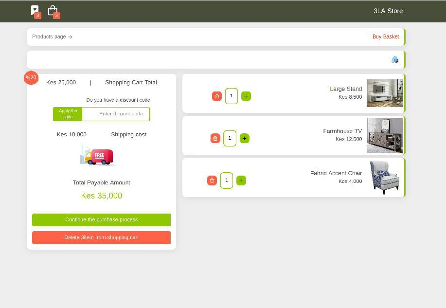

3LA store website
description

This is a Furniture shop website build with react.js that showcases the current featured products of the store. the landing page targets to attract the customer attention to the featured products.

Technologies used

HTML CSS JS React

Package in Project:

- react-router-dom
- React Icon

Feature

- info page for products
- state management with useReducer Hook and Context Api
- Filter Based on category
- Filter Based on Products Name
- Full Responsive in All Device
- ‌Basket shopping
- Add, Delete, Clear Basket, Decrease, Increase, Product in Basket
- Show Number of products In Badge
- calculation Total Price

Find link to the live site here  https://amazing-custard-7997ab.netlify.app/
Project screen shots: 
Project screen shots: 

Development

Any additional code development to improve the website is welcome. kindly fork and clone the wedbsite code and upload changes when done.

Installation and Setup Instructions

Clone down this repository. You will need node and npm installed globally on your machine.
Installation

Run either npm install or yarn in project root directory and client folder to build all dependencies.
Firebase config

To Visit App:

localhost:3000

Authors

@AlnOo Allan Odhhiambo